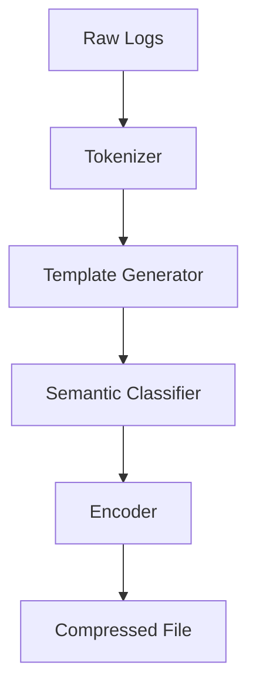

# Documentation Directory

Project documentation for logpress system.

## Structure

```
documentation/
├── README.md                    # This file
├── TESTING.md                   # Testing strategy and guides
├── MCP_ARCHITECTURE.md          # System design documentation
├── MCP_ROOT_STRUCTURE.md        # Root directory organization
├── MCP_MIGRATION_COMPLETE.md    # Migration documentation (historical)
├── PRODUCTION_READY.md          # Production deployment guide
└── docs/                        # Additional documentation
```

## Documentation Index

### Core Documentation

#### [TESTING.md](TESTING.md)
Comprehensive testing guide covering:
- Test suite structure (unit, integration, e2e, performance)
- Running tests (`pytest` commands)
- Coverage reporting
- Performance benchmarking
- Writing new tests
- CI/CD integration

**Quick Start**:
```bash
# Run all tests
bash scripts/run-tests.sh

# Run specific category
python -m pytest logpress/tests/unit/ -v
```

#### [EXAMPLES_TESTING.md](EXAMPLES_TESTING.md)
Complete guide for testing all 9 LogPress examples:
- Status of all examples (✅ All passing)
- Core examples (01-06): Work with core installation
- Integration examples (07-09): Require optional dependencies
- Installation matrix and test commands
- Why each optional dependency is needed
- CI/CD integration for examples
- Troubleshooting common issues

**Quick Test**:
```bash
# Test all examples (01-06 work with core install)
python examples/01_basic_compression.py
python examples/02_query_compressed_logs.py
python examples/03_streaming_large_files.py
python examples/04_custom_semantic_types.py
python examples/05_schema_extraction_only.py
python examples/06_batch_processing.py

# Examples 07-09 require optional dependencies
pip install LogPress[web]        # For example 07 (Flask REST API)
pip install LogPress[api]        # For example 08 (FastAPI service)
pip install LogPress[monitoring] # For example 09 (Log rotation handler)
```

#### [MCP_ARCHITECTURE.md](MCP_ARCHITECTURE.md)
System design and architecture documentation:
- MCP (Model-Context-Protocol) layers explained
- Package structure rationale
- Component interactions
- Extension points
- Design patterns used

**Layers**:
- **Models**: Pure data structures
- **Protocols**: Abstract interfaces
- **Context**: Business logpress (tokenization, extraction, classification, encoding)
- **Services**: High-level orchestration (compressor, query engine, evaluator)
- **CLI**: User interfaces

#### [MCP_ROOT_STRUCTURE.md](MCP_ROOT_STRUCTURE.md)
Root directory organization:
- `data/` - Input datasets and ground truth
- `evaluation/` - Outputs and results
- `deployment/` - Docker infrastructure
- `documentation/` - Project docs
- `scripts/` - Automation

#### [PRODUCTION_READY.md](PRODUCTION_READY.md)
Production deployment checklist:
- Pre-deployment validation
- Docker deployment steps
- Environment configuration
- Monitoring and logging
- Troubleshooting guides

### Historical Documentation

#### [MCP_MIGRATION_COMPLETE.md](MCP_MIGRATION_COMPLETE.md)
Documents the migration from flat structure to MCP architecture:
- Files moved and reorganized
- Import path updates
- Validation steps performed
- Lessons learned

**Note**: Historical reference only, migration is complete.

## Quick Links

### Getting Started
- [Main README](../README.md) - Project overview
- [Installation Guide](../README.md#quick-start)
- [Quick Start Examples](../README.md#command-line-usage)

### Development
- [logpress Package README](../logpress/README.md) - API reference
- [Testing Guide](TESTING.md) - Write and run tests
- [Architecture Guide](MCP_ARCHITECTURE.md) - System design

### Deployment
- [Docker Guide](../deployment/README.md) - Container deployment
- [Production Guide](PRODUCTION_READY.md) - Deploy to production
- [Scripts Guide](../scripts/README.md) - Automation scripts

### Data
- [Data Directory](../data/README.md) - Datasets and ground truth
- [Evaluation Guide](../evaluation/README.md) - Results and metrics

## Documentation Standards

### Markdown Style

- Use ATX-style headers (`#`, `##`, `###`)
- Include code language tags in fenced code blocks
- Use tables for structured data
- Include emoji for visual markers (✅, ❌, ⚠️, 🔍, etc.)

### Code Examples

Always include:
1. **Context**: What the example demonstrates
2. **Code**: Fully working example
3. **Output**: Expected result or behavior

**Example**:
```python
# Context: Compress a log file
from logpress.services import SemanticCompressor

# Code
compressor = SemanticCompressor(min_support=3)
compressed_log, stats = compressor.compress(log_lines)

# Output
print(f"Compression ratio: {stats.compression_ratio:.2f}x")
# Compression ratio: 11.2x
```

### Documentation Sections

Every README should include:
1. **Overview**: What this directory/component does
2. **Structure**: Directory/file layout
3. **Usage**: How to use it
4. **Examples**: Concrete examples
5. **Troubleshooting**: Common issues
6. **See Also**: Links to related docs

## Contributing to Documentation

### Adding New Documentation

1. **Create file** in appropriate directory:
   ```bash
   # API documentation
   touch documentation/docs/api/new-feature.md
   
   # Tutorial
   touch documentation/docs/tutorials/compression-guide.md
   ```

2. **Follow template**:
   ```markdown
   # Title
   
   Brief description (1-2 sentences).
   
   ## Overview
   
   Detailed explanation.
   
   ## Usage
   
   Examples and instructions.
   
   ## See Also
   
   - [Related Doc 1](link1.md)
   - [Related Doc 2](link2.md)
   ```

3. **Add to index**:
   - Update this README.md with link
   - Update parent README.md if relevant

### Updating Existing Documentation

1. **Keep consistent style**
2. **Update code examples** if API changes
3. **Test code examples** to ensure they work
4. **Update timestamps** if significant changes

### Documentation Review Checklist

Before committing documentation:
- [ ] Spell check passed
- [ ] Code examples tested and work
- [ ] Links are valid (no 404s)
- [ ] Formatting is consistent
- [ ] No sensitive information (passwords, keys, etc.)
- [ ] Screenshots are up-to-date (if applicable)

## API Documentation

### Generating API Docs

```bash
# Install documentation tools
pip install sphinx sphinx-rtd-theme sphinx-autodoc-typehints

# Generate docs
cd documentation/docs
sphinx-quickstart
sphinx-apidoc -o source/ ../logpress/
make html

# View docs
firefox build/html/index.html
```

### API Documentation Structure

```
docs/
├── source/
│   ├── conf.py              # Sphinx configuration
│   ├── index.rst            # Main page
│   ├── api/
│   │   ├── models.rst       # Models documentation
│   │   ├── protocols.rst    # Protocols documentation
│   │   ├── context.rst      # Context documentation
│   │   └── services.rst     # Services documentation
│   └── tutorials/
│       ├── compression.rst  # Compression tutorial
│       └── querying.rst     # Query tutorial
└── build/
    └── html/                # Generated HTML docs
```

## Research Documentation

### Thesis Chapters

Structure for Master's thesis writing:

```
documentation/thesis/
├── 01-introduction.md
├── 02-related-work.md
├── 03-methodology.md
├── 04-implementation.md
├── 05-evaluation.md
├── 06-conclusion.md
└── appendix/
    ├── a-dataset-details.md
    ├── b-algorithms.md
    └── c-results-tables.md
```

### Research Notes

```
documentation/research/
├── literature-review.md     # Papers and related work
├── design-decisions.md      # Why we chose X over Y
├── experiments.md           # Experimental results
└── open-questions.md        # Future work ideas
```

## Diagrams and Visualizations

### Architecture Diagrams

```
documentation/diagrams/
├── system-architecture.png
├── compression-pipeline.png
├── query-flow.png
└── mcp-layers.png
```

**Generate with**:
- [PlantUML](https://plantuml.com/) for UML diagrams
- [Mermaid](https://mermaid-js.github.io/) for flowcharts
- [Graphviz](https://graphviz.org/) for graphs

**Example Mermaid**:


## Documentation Tools

### Recommended Tools

- **Markdown Editor**: VSCode with Markdown Preview Enhanced
- **Diagram Tools**: draw.io, PlantUML, Mermaid
- **API Docs**: Sphinx (Python)
- **Spell Check**: `aspell`, VSCode spell checker
- **Link Checker**: `markdown-link-check`

### Validation Scripts

```bash
# Check for broken links
npm install -g markdown-link-check
find . -name "*.md" -exec markdown-link-check {} \;

# Spell check
aspell check documentation/README.md

# Markdown linting
npm install -g markdownlint-cli
markdownlint documentation/**/*.md
```

## Documentation Maintenance

### Regular Updates

Update documentation when:
- ✅ Adding new features
- ✅ Changing APIs
- ✅ Fixing bugs
- ✅ Refactoring code
- ✅ Adding new dependencies
- ✅ Changing configuration

### Version Control

- Keep docs in sync with code
- Use same branch for code and doc changes
- Include doc updates in PRs
- Review docs during code review

### Documentation TODOs

Current gaps to fill:
- [ ] API reference (auto-generated from docstrings)
- [ ] Video tutorials
- [ ] Interactive examples (Jupyter notebooks)
- [ ] Performance tuning guide
- [ ] Advanced query examples
- [ ] Custom encoder development guide

## Help and Support

### Getting Help

1. **Check documentation first**
   - Main README
   - Component-specific READMEs
   - API documentation

2. **Run validation scripts**
   ```bash
   bash scripts/run-pre-production-tests.sh
   ```

3. **Check test examples**
   ```bash
   grep -r "def test_" logpress/tests/
   ```

4. **Open an issue**
   - GitHub Issues for bug reports
   - Include error messages and context

### Contributing Documentation

We welcome documentation contributions:
- Fix typos and grammar
- Improve unclear explanations
- Add missing examples
- Translate to other languages
- Add diagrams and visualizations

See [CONTRIBUTING.md](../CONTRIBUTING.md) for guidelines.

---

**See parent [README.md](../README.md) for complete project information.**
